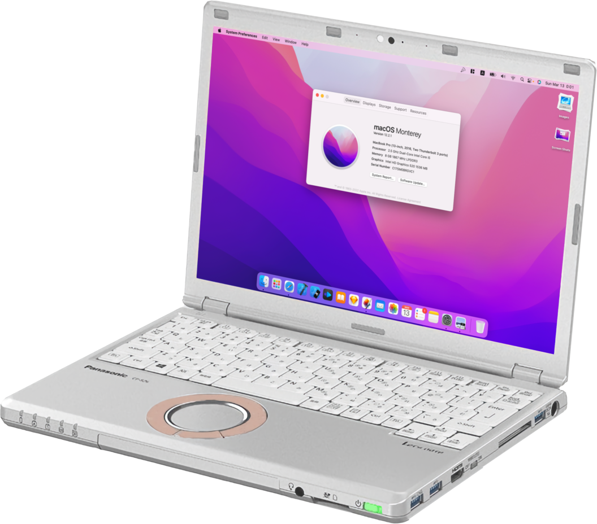

# Panasonic-CF-SZ5-Hackintosh
Panasonic Let's Note CF-SZ5 EFI Folder (OpenCore)

[](https://developer.apple.com/documentation/macos-release-notes)
[](https://github.com/acidanthera/OpenCorePkg)

This is an EFI Folder of MY Panasonic Let's Note CF-SZ5 Running macOS Monterey Build (21G5027d). Not prepped really well, but i'm pretty fine with it cause I have like 0 issues for daily use.



## Detail of Specification

|Model|CF-SZ5 SZ5PDYVS|
|-|-|
|Processor|Intel Core i5-6300U|
|IGPU|Intel HD Graphics 520|
|RAM|8GB| 
|Storage|1x SSD SAMSUNG 256GB|
|Wifi & Bluetooth|Intel AC7265 and Bluetooth|
|Touchpad|SYN052 Synaptics Touchpad|
|Screen Size|12”|
|Display Resolution|1920 x 1200(WUXGA)|
|Bootloader|OpenCore 0.8.0|
|OS Version|macOS Monterey 12.5 Beta|
|Installer|Vanilla (macApps Store)|

---

## Functional Status

|Function / Hardware|Status|
|-|-|
|iGPU HD520 Acceleration|Working|
|CPU Power Management|Working - idles at 800MHz, boosts to max Turbo frequency|
|Laptop Keyboard|Working|
|Laptop Trackpad|Working|
|Laptop Headphones Jack|Working|
|Built-in Speakers|Working|
|Built-in Mic|Working|
|Hotkeys for audio|Working|
|USB 3.x|Working|
|Screen brightness|Working, hotkeys fn+f1/fn+f2 to decrease/increase brightness|
|Built-in Wifi|Working|
|Built-in Bluetooth|Working|
|Built-in webcam|Working|
|Sleep|Working|

---

## BIOS Settings

Disabled

- VT-d
- Secure Boot
- FastBoot
- CFG-Lock (via ModGRUBShell)

Changed
- DVMT to 128Mb

---

## Disabling CFG_Lock

Make sure the modGRUBShell is in the EFI folder EFI/Tools and is also added in config.plist>tools 

Important!
There might be a different value data for your CFG_Lock bios. Make sure you follow Dortania post install guides (https://dortania.github.io/OpenCore-Install-Guide/)

```
setup_var_3 0xA0F 0x00
reboot
```


## IMPORTANT NOTE

I created this github repository for my own documentation and my own device. I do not take responsibilities if there's any issues you encounter while trying to use my OpenCore setup. Once again, </b>I DO NOT TAKE ANY RESPONSIBILITIES IF SOMETHING WRONG HAPPENED WITH YOUR DEVICE USING MY CONFIG!</b>

---

Thanks to all of the developers who are providing the best work for the kexts:

- thanks to https://github.com/acidanthera for providing OpenCore and other really usefull kext
- thanks to https://github.com/vit9696 for providing Lilu
- thanks to https://github.com/zxystd for providing airportitlwm & IntelBluetoothFirmware
- Others.
